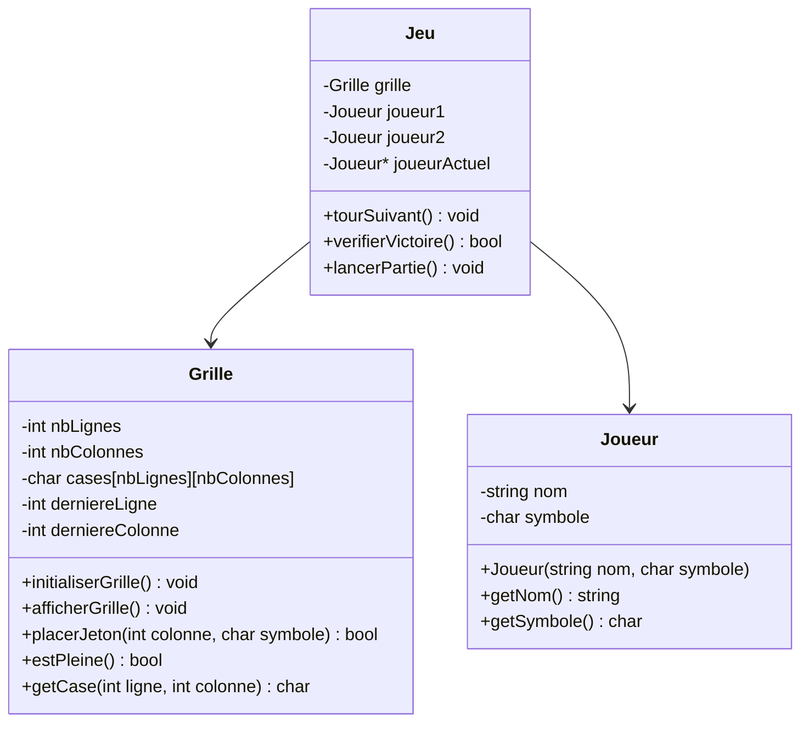

# Diagramme UML simplifie

```mermaid
classDiagram
    class Joueur {
        -string nom
        -char symbole
        +Joueur(string nom, char symbole)
        +getNom() string
        +getSymbole() char
    }

    class Grille {
        -int nbLignes
        -int nbColonnes
        -char cases[nbLignes][nbColonnes]
        -int derniereLigne
        -int derniereColonne
        +initialiserGrille() void
        +afficherGrille() void
        +placerJeton(int colonne, char symbole) bool
        +estPleine() bool
        +getCase(int ligne, int colonne) char
    }

    class Jeu {
        -Grille grille
        -Joueur joueur1
        -Joueur joueur2
        -Joueur* joueurActuel
        +tourSuivant() void
        +verifierVictoire() bool
        +lancerPartie() void
    }

    Jeu --> Grille
    Jeu --> Joueur
```
